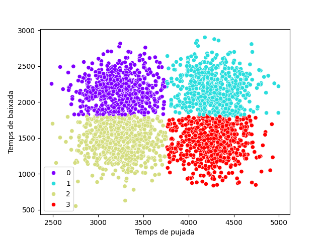

# Python Machine Learning Portcanto


---

## Taula de continguts
1. [Portcanto](#portcanto)
2. [Execució](#run)
3. [Docker](#docker)
4. [Clustering](#clustering)
5. [MLflow](#mlflow)
6. [Documentació del codi](#docs)
7. [Qualitat del codi](#qualitat)
7. [Testing](#tests)
8. [Llicència](#licence)

---

### Portcanto <a name="portcanto"></a>
**Portcanto** és un projecte de simulació d'un trajecte en bicicleta. S'ha definit 4 tipus de ciclistes que es diferencien en el temps que tarda a fer el trajecte.

L'objectiu és descobrir els 4 patrons amb l'algoritme de clustering KMeans.

Es vol crear dades sintètiques per poder fer un anàlisi de les dades amb IA (bàsicament un problema de clustering).

Consta de dos arxius principals:

- [Generar dataset](generardataset.py): Consisteix a generar diferents dades de cada tipus de ciclista i emmagatzemar totes les dades en un arxiu csv.

- [Cluster ciclistes](clustersciclistes.py): Consisteix principalment a realitzar un anàlisi exploratori de les dades del dataset, generar una imatge per poder visualitzar els diferents clusters, generació d'informes, classificació de noves dades i etc.

Consta també de diferents carpetes i scripts relacionats amb l'anàlisi de les dades i la solució amb IA del problema del clustering.

---

### Execució <a name="run"></a>
Descarregar i ficar-se dins del projecte:
```
$ git clone https://github.com/JAVI-CC/python-ml-portcanto

$ cd python-ml-portcanto
```

Ara pots crear un entorn virtual fent:
```
$ python -m venv venv
 o bé:
$ virtualenv venv

$ source venv/bin/activate
```

i tot seguit instal·lar els mòduls necessaris:
```
$ pip install --no-cache-dir -r requirements.txt
```

Per executar:
```
$ python generardataset.py
```

```
$ python clustersciclistes.py
```

---

### Docker <a name="docker"></a><g-emoji class="g-emoji" alias="whale" fallback-src="https://github.githubassets.com/images/icons/emoji/unicode/1f433.png">🐳</g-emoji>

<span>Enllaç del repositori de la imatge: <a href="https://hub.docker.com/r/javi98/python-ml-portcanto" target="_blank">https://hub.docker.com/r/javi98/python-ml-portcanto</a></span>

#### Contenidors:
* python:3.12 - ```:5000 # Interfície web MLflow```

#### Execució:
```
$ git clone https://github.com/JAVI-CC/python-ml-portcanto
$ cd python-ml-portcanto
$ docker compose up -d
$ docker compose exec app python generardataset.py
$ docker compose exec app python clustersciclistes.py
```

Una vegada que estigui desplegat el contenidor correctament, per defecte ja es troba arrencat la interfície web de MLflow i pots accedir a la interfície web de MLflow a través de l'url: <a href="http://localhost:5000" target="_blank">http://localhost:5000</a>

---

### Clustering <a name="clustering"></a>

En l'arxiu [clustersciclistes.py](clustersciclistes.py) es resol el problema de trobar els clústers per a les dades simulades.

S'obtenen 4 clústers.



---

### MLflow <a name="mlflow"></a>

MLflow es tracta d'una plataforma per optimitzar el desenvolupament d'aprenentatge automàtic, que inclou el seguiment d'experiments i l'ús compartit i la implementació de models.

Per generar l'experiment:
(Per defecte ja es troba generat l'experiment.)
```
$ python mlflowtracking-K.py
```

Per arrencar la interfície web:

```
$ mlflow ui
```

Url per accedir a la interfície web: <a href="http://localhost:5000" target="_blank">http://localhost:5000</a>

---

### Documentació del codi <a name="docs"></a>
Pots veure la documentació del codi generat dins del directori docs.
 * [clustersciclistes.html](docs/clustersciclistes.html)
 * [generardataset.html](docs/generardataset.html)

Per generar la documentació del codi:
(Per defecte ja es troba generat la documentació del codi.)
```
$ python -m pydoc -w ./generardataset.py
$ python -m pydoc -w ./clustersciclistes.py
 o bé:
$ python gendocs.py
```

---

### Qualitat del codi <a name="qualitat"></a>

Per comprovar la qualitat del codi:
```
$ cd pylint
$ pylint ../generardataset.py
$ pylint ../clustersciclistes.py
```

---

### Testing <a name="tests"></a>

Per executar tots els tests del projecte:

```
$ python -m unittest discover -s tests
```

---

### Llicència <a name="licence"></a>
**JAVI-CC** - IOC (2024)
Llicència MIT. [LICENSE.txt](LICENSE.txt) per més detalls

